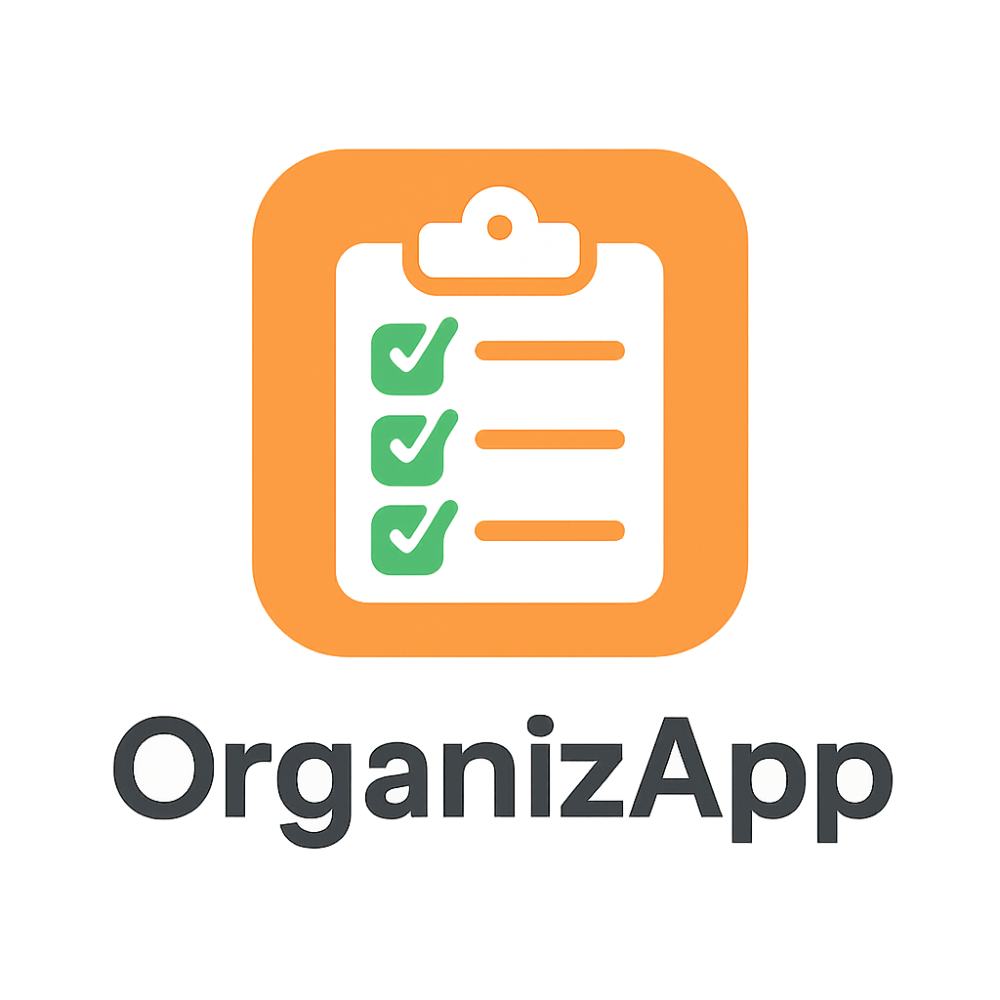

# OrganizApp

## 📱 Sobre o App

O **OrganizApp** é um aplicativo mobile de lista de tarefas, com o objetivo de ajudar os usuários a se organizarem melhor no dia a dia. Ele permite criar, visualizar e gerenciar tarefas de forma simples e intuitiva.
O app foi pensado para ser leve, funcional e acessível, com um design limpo e objetivo, ideal para quem busca produtividade sem complicações.

## 🎨 Protótipos de Tela

Abaixo estão os protótipos iniciais do OrganizApp, representando as principais telas do app mobile. Essas telas foram desenvolvidas com foco na simplicidade, acessibilidade e funcionalidade, refletindo o design planejado para o MVP do aplicativo.

### 🖼️ Telas incluídas no protótipo:
- Tela de Splash (Logo de abertura)
- Tela de Lista de Tarefas
- Tela de Adição de Nova Tarefa
- Tela de Edição de Tarefa

## 📊 Modelagem do Banco de Dados

O banco de dados utilizado no OrganizApp é local, usando SQLite. A estrutura é composta por uma única tabela `tasks`, responsável por armazenar as tarefas criadas pelo usuário.

### 🔗 Diagrama ER (Entidade-Relacionamento)

Ou veja no link direto: [Abrir Diagrama ERD](https://drive.google.com/file/d/1o5kaSsWEF0JNLcLWGPl_Isfj0crMPOjM/view?usp=sharing)

### 📄 Estrutura da Tabela `tasks`

| Campo         | Tipo       | Descrição                           |
|---------------|------------|-------------------------------------|
| `id`          | INTEGER    | Chave primária, auto incremento     |
| `title`       | TEXT       | Título da tarefa                    |
| `is_done`     | BOOLEAN    | Indica se a tarefa foi concluída    |
| `created_at`  | DATETIME   | Data/hora em que foi criada         |

## 📅 Planejamento de Sprints

### Sprints:
- [X] Configuração de ferramentas e IDE.
- [X] Criação do repositório no GitHub.
- [X] Definição de estrutura de pastas e organização do código.
- [ ] Instalação das dependências iniciais.
- [X] Criação de wireframes e protótipos das principais telas no Figma (ou outra ferramenta).
- [ ] Criação das telas principais do app.
- [ ] Implementação de funcionalidades básicas (como adição e visualização de tarefas).
- [ ] Testes iniciais de usabilidade.
- [ ] Implementação de funções CRUD para tarefas.
- [ ] Adição de categorias e prazos para as tarefas.
- [ ] Testes de funcionalidades completas.
- [ ] Correção de bugs encontrados.
- [ ] Otimização de desempenho.
- [ ] Ajustes finais de design.
